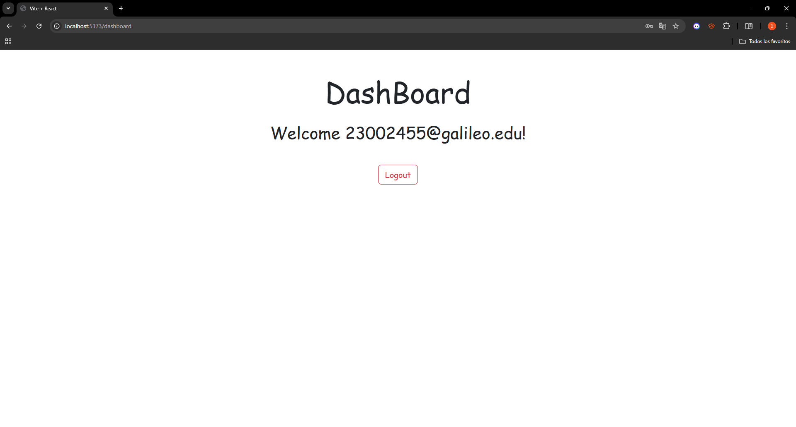

# Firebase Authentication App

This project is a React application that implements authentication using Firebase. Users can register, log in with email/password, Google, or GitHub, reset their password, and log out.

## Features
- User registration and login using Firebase Authentication.
- Login with Google and GitHub.
- Password reset functionality.
- Protected routes (dashboard access only for authenticated users).
- Logout functionality.

## Prerequisites
Make sure you have the following installed:
- Node.js (latest LTS recommended)
- npm or yarn

## Getting Started
### 1. Clone the Repository
```sh
git clone https://github.com/dani31perez/firebase-auth.git
cd your-repository
```

### 2. Install Dependencies
```sh
npm install
# or
yarn install
```

### 4. Run the Application
```sh
npm run dev 
# or
yarn dev
```

## Available Routes
| Route        | Description |
|-------------|-------------|
| `/`         | Shows login page if not authenticated, otherwise redirects to Dashboard |
| `/register` | User registration page |
| `/reset`    | Password reset page |
| `/dashboard`| Protected route, only accessible if authenticated |

## Technologies Used
- React.js
- Firebase Authentication
- React Router
- React Bootstrap

## Example Usage

### Register a New User
1. Navigate to `/register`.
2. Enter an email and password.
3. Click the **Register** button.

### Login
1. Navigate to `/`.
2. Enter your email and password.
3. Click the **Login** button.
4. Alternatively, login with Google or GitHub.

### Reset Password
1. Navigate to `/reset`.
2. Enter your email.
3. Click **Reset Password**, and check your inbox for the reset link.

### Logout
1. After logging in, you will be redirected to /dashboard.

2. The dashboard will display a welcome message and a logout button.

3. Click Logout to sign out of your account.

## Screenshots (Optional)

| Feature         | Screenshot |
|----------------|------------|
| Login Page     |  |
| Register Page  |  |
| Dashboard      |  |
| Reset Password    |  |

## License
This project is licensed under the MIT License.

You can preview the project using my CodeSandbox link: https://codesandbox.io/p/sandbox/2vr9ht